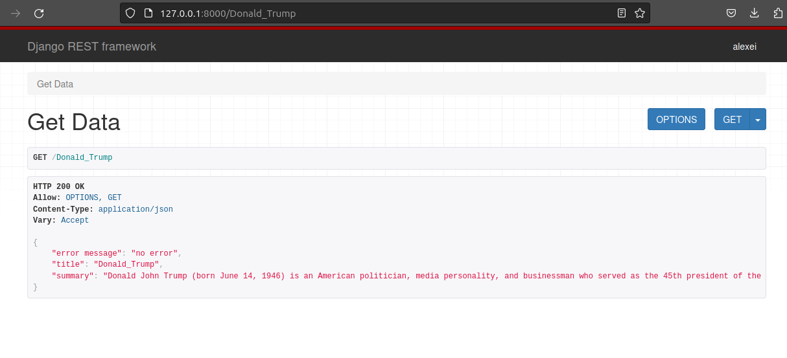
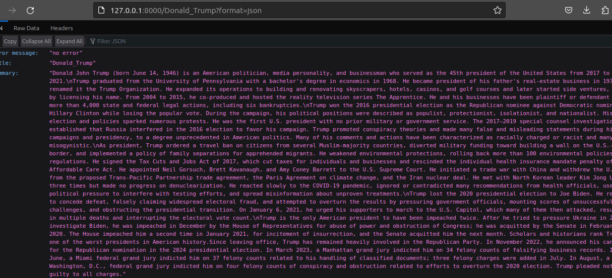
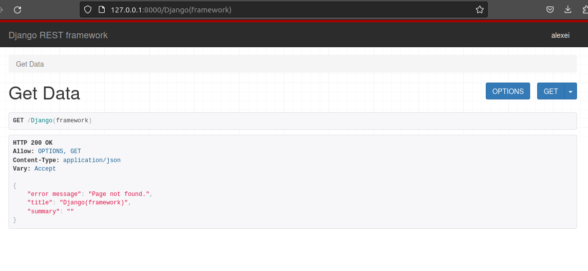
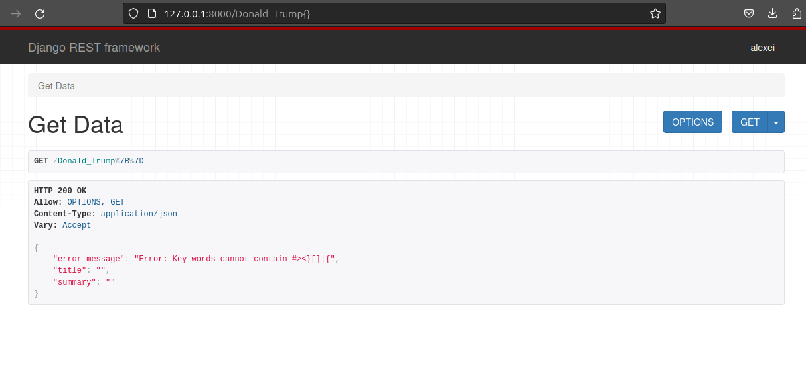

What is it about?

This Python code, powered by the Django API framework, serves as a versatile tool for accessing Wikipedia articles and performing detailed analysis on both their descriptions and content. By harnessing the capabilities of Django, this application extracts valuable information from Wikipedia articles and compiles it into a structured JSON format for further use and analysis.

This application is ideal for researchers, data analysts, and knowledge enthusiasts looking to automate the process of extracting and analyzing information from Wikipedia articles. Whether you're exploring trends, conducting research, or building data-driven applications, this tool streamlines the data gathering process and makes it readily available for your projects.

How to run the project?

The project is still in developpment so it is not ready for deployment.
(The settings are set to developpement)
To run the project:
(1) Clone the repo ang go to it.
(2) Create python virtual environment
    - For linux: python3 -m venv <name>
(3) Start the environment:
    - workon <name>
(4)  Go to the folder containing manage.py
(5) You will need to meet the requirements before running the local server:
    Run pip install -r requirements.txt
(5) Run: python3 mange.py runserver to run the server.
    No additional command is needed to run the server, you can check the result on
    your browser on the adress: http://http://127.0.0.1:8000/'title'.
    The 'title' is the title of the wikipedia article you are looking for,
    but wait for part (8)
(6) In order to check if the app is properly sending mails, you will need to create another
    virtual environment. Create it using the same method as previously.
(7) Run it in a different window and type: python -m smtpd -n -c DebuggingServer localhost:1025
    This virtual environment will keep track of the email send by the server. Unfortunately,
    it might be slow...
(8) Finally, you can do your own research. For example type http://127.0.0.1:8000/Django_(framework).

What are the important choices I decide to make and why ?

I begin the project by service.py and I decided to make a class (Result)
which will save the result of the wikipediapi research from the user entry.
And all the function in service.py are not related to this class so they could have another use.This way the content will be easy to access on views.py and 
more attributes could be sent.Whenever a summary hit 20% or more of 5+ words
an excpetion is raised.
Nevertheless, the api view does the job by sending effectively the result 
of service. BUT, I wasn't able to make it work with request.GET.get('title')
and I found no or too little documentation on this. After looking closely
it appears that the dict request.GET is empty when get_data is running.
I apologize for that, if anyone know this problem and have a solution for it
I would be happy to know it.

With its user-friendly interface and powerful Django backend, it simplifies the task of gathering and analyzing Wikipedia content.

Feel free to adapt and expand the description as needed to provide more context or additional details about your code.

some examples:

.A research about Donald_Trump:

full output:

.A research about Emmanuel_macron:

.An example where the article does not exists (at least back in 9/4/2023):

.An example where banned character such as '#><}[]|{' (banned character from wikipediaapi) is used within the input:

